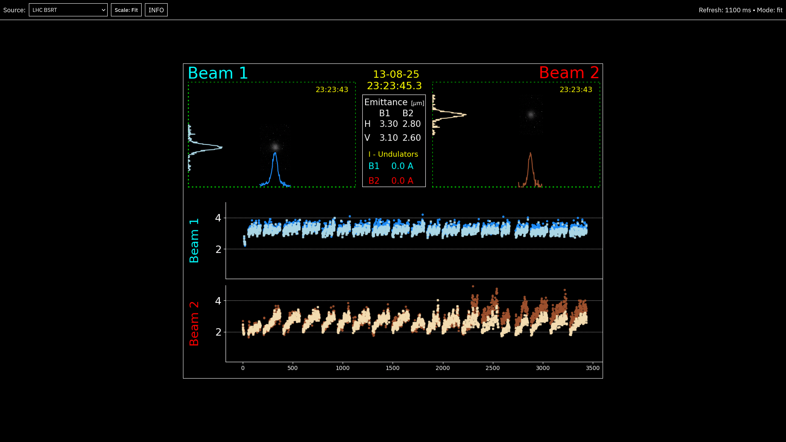

# vistar-restyled

A restyled version of [CERN's Vistars](https://op-webtools.web.cern.ch/vistar/), optimised for use as background screensaver (i.e. **_should not be relied on for anything important_**)

Hosted as a [static site](https://autumn-mck.github.io/vistar-restyled/) on Github Pages.

